<style>
img[alt~="center"] {
  display: block;
  margin: 0 auto;
}
</style>

# Digital konst med WebGL

> Realtidsgrafik för nöjes skull

Peter Leinonen, 2023-10-19

---

## Agenda

- Demos & demoscenen
- WebGL
  - GLSL
  - Bibliotek & ramverk
- 2D & 3D grafik med endast två trianglar
  - Grunder i GLSL & exempel shaders
  - Avancerade tekniker
    - Raytracing & Raymarching
    - Belysning och skuggning
    - Reflektioner
    - CSG - Constructive Solid Geometry

---

## Demoscenen

- Internationell datorkonst-subkultur fokuserad på att producera *demos*.

- Dett demo är ett fristående datorprogram som producerar audiovisuella presentationer.
  - Syftet är att visa upp programmering, bildkonst och musikaliska färdigheter.

[Conspiracy - Universal Sequence](https://www.youtube.com/watch?v=1PmRoLFtPRo)

---

## Demoscenen uppstod på 80-talet

- Hemdatorer som Commodore 64 och Amiga, där entusiaster skapade kompakta, visuellt fantastiska och ljudmässigt imponerande program. 
- Senare även på PC.
- Ursprunget kommer från "crack-intros", intro skärmar till spel vars kopieringsskydd tagits bort, och visas innan spelet startar. Utvecklades vidare till en egen grej.

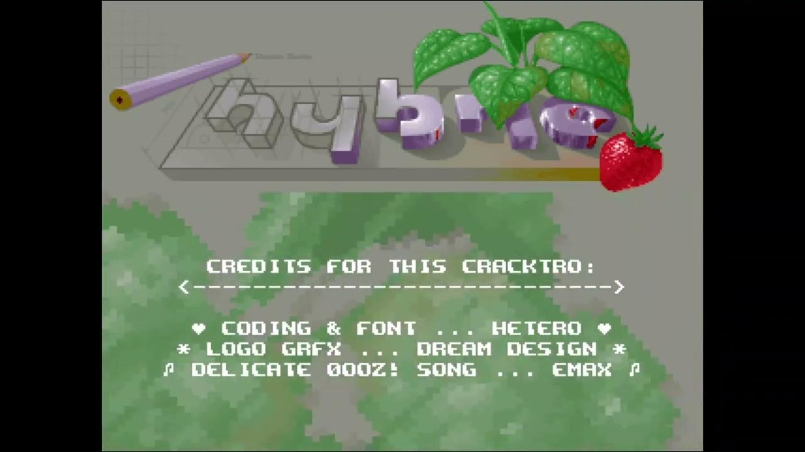

---

## Demoparty

- Demoscenen är en tävlingsinriktad subkultur, med grupper och enskilda artister som tävlar mot varandra i teknisk och konstnärlig excellens. 

- En demo grupp består vanligtvis av en kodare, en musiker och en grafiker. Både gruppen och dess medlemmar använder sig ofta av nicknames/alias istället för sina riktiga namn.

- Grupper träffas och tävlar på demopartyn.


---

## Compos

I ett compo tävlar grupper/individer i olika kategorier, som har sina olika regler och begränsningar.

- __4k intro__  - Programmet får vara max __4096 bytes__
- __64k intro__ - Programmet får vara max __65536 bytes__
- __Live shader coding__
  - 2 personer sitter vid var sin dator på scenen och skriver kod tills tiden tar slut
  - Resultaten visas på projektor
  - Publiken röstar, snyggast vinner

Även olika plattformar: PC, amiga, atari etc..

---

## Fun fact

År 2020 lade Finland till sin demoscen på sin nationella UNESCO-lista över immateriellt kulturarv. Det är den första digitala subkulturen som sätts upp på en immateriellt kulturarvslista. 

---

## Demos är digitala konstverk

- Realtid, lägger till en interaktiv dimension till konsten.
- Ofta abstrakt visuell design. 
- Musik spelar en central roll i demos.
  - Kompositörer skapar originalljudspår som synkroniserar med det visuella, vilket förstärker demots känslomässiga inverkan. Ofta en blandning av olika elektroniska musikgenrer, vilket bidrar till den övergripande konstnärliga upplevelsen.
- Demos tänjer på gränserna och visar upp teknisk innovation som en form av konstnärligt uttryck.

---

## WebGL - en kort introduktion

- WebGL står för "Web Graphics Library."
- Det är ett JavaScript API för att rendera 2D- och 3D-grafik i webbläsare.
- Utvecklat av Khronos Group, baserat på OpenGL ES. 
- Det möjliggör högpresterande grafik utan plugins.
- WebGL använder HTML5 canvas element för rendering.
- Det är kapabelt till komplex 3D-rendering, animationer och simuleringar.
- WebGL-program är skrivna i GLSL (OpenGL Shading Language).

---

## WebGL koncept

__WebGL-kontext:__ Nås via `canvas.getContext('webgl')`.
__Buffers:__ Lagra data (t.ex. hörn (vertices), färger) på grafikprocessorn.
__Shaders:__ Vertex och Fragment shaders styr renderingen.
__Texturer:__ Används för att applicera bilder på 3D-objekt.
__Renderings loop__: Uppdaterar och ritar om canvasen kontinuerligt.

---

## GLSL - OpenGL Shading Language

- Ett specialiserat språk för programmering av shaders.
- Används för att implementera ljussättning, material och komplexa visuella effekter.

---

## GLSL - Två typer av shaders

- __Vertex Shader:__ Transformerar 3D punkter till 2D "screen space".
- __Fragment Shader__ (Pixel Shader): Beräknar pixel färger and ljus.

---

## GLSL - Syntax and Structure

- C-liknande syntax med datatyper, funktioner, and variabler.
- Inbyggda variabler
  -  `gl_Position`, `gl_FragColor`
- Datatyper:
  - `int`, `float`, `vec2`, `vec3`, `vec4`, `mat2`, `mat3`, `mat4`, `struct`
- `uniform`
  - Data som delas genom alla shader anrop.
- `attribute`
  - Per-vertex data: positioner, normaler och färger.
- Exempel på inbyggda funktioner:
  - `sin`, `cos`, `length`, `normalize`, `dot`, `cross`, `clamp`, `texture2D`
- `main()` functions for both vertex and fragment shaders.

---

## WebGL - Översikt

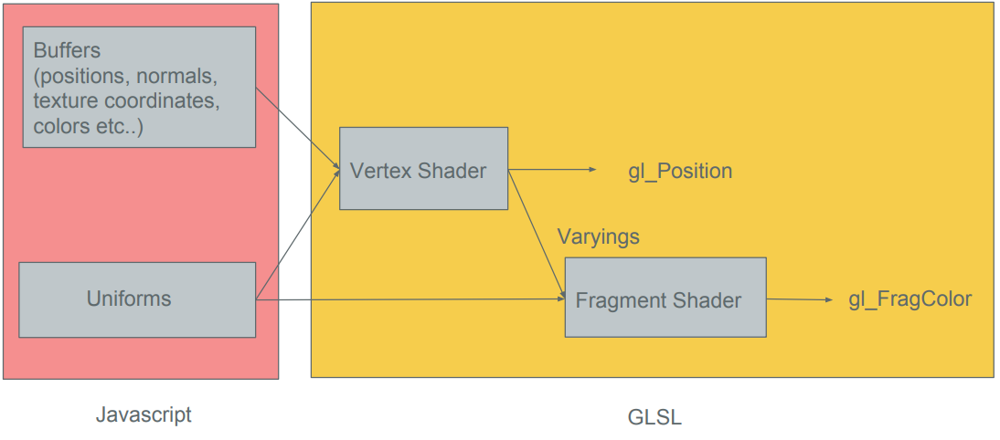

---

## Shader Program kommer i par


### Vertex shader example
```glsl
attribute vec4 position;

void main() {
  gl_Position = position; // set position without any transformation
}
```

### Fragment shader example
```glsl
precision mediump float;

void main() {
  gl_FragColor = vec4( 0.0, 1.0, 0.0, 1.0 ); // RGBA
}
```

---

# WebGL är ett pratigt API

- Mycket kod för att göra lite. Lämpligt att använda ett bibliotek som förenklar. 
  - Three.js
  - TWGL.js

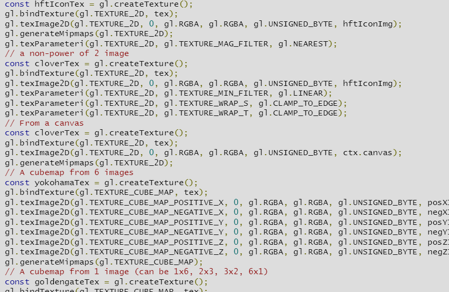

---

## Grafik med två trianglar

Rita två trianglar som täcker hela skärmytan och anropa en pixel (fragment) shader som skapar en animerad eller statisk bild

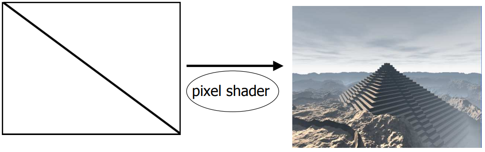

---

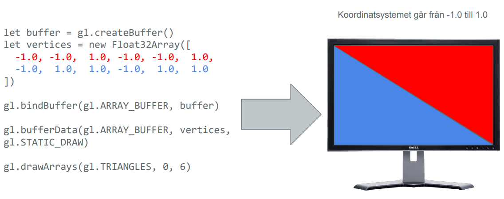

---

## Playgrounds med detta koncept

- https://www.shadertoy.com/
  - Dator med bra grafikkort rekommenderas!
- http://webglplayground.net/

### VS Code extensions
- glsl-canvas
    - Live preview of fragment shaders, just start coding!
- Shader languages support for VS Code
    - Syntax highlight

---

# Live demo time!

---

# Avancerade tekniker

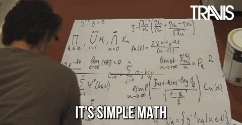

---

## Raytracing


I raytracing simulerar du beteendet hos ljusstrålar när de interagerar med objekt i en scen. Strålar kastas från en kamera eller ett öga in i scenen för att avgöra vilka föremål som är synliga och hur de påverkar belysningen.

I raytracing beräknas skärningspunkterna mellan strålar och ytorna på 3D-objekt i scenen med hjälp av geometriska algoritmer.

---

## Raymarching

Raymarching, å andra sidan, förenklar beräkningarna genom att använda en numerisk metod. Istället för att beräkna den exakta skärningspunkten "stegar" (marscherar?) den längs strålen i små steg och testar om den aktuella positionen är inuti eller utanför ett föremål. 

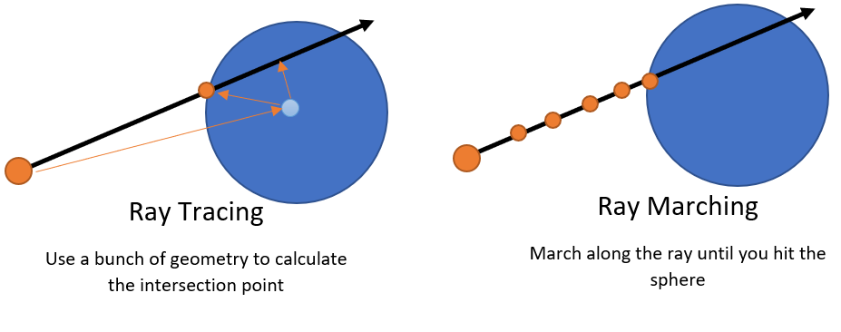

Denna process fortsätter tills strålen antingen träffar ett objekts yta eller når ett definierat maximalt avstånd.

---

## Signed Distance Functions (SDF):

- Raymarching använder en funktion som definierar *teckenavståndet* (signed distance) från en punkt till närmaste objekts yta.

- En SDF är en matematisk funktion som tar en 3D-punkt som indata och returnerar det kortaste avståndet från den punkten till närmaste yta. Resultatets *signum* indikerar om punkten är innanför eller utanför objektet. 

- Raymarching använder SDF för att bestämma hur långt man ska marschera längs strålen och för att leta efter skärningspukter.

---

## Exempel

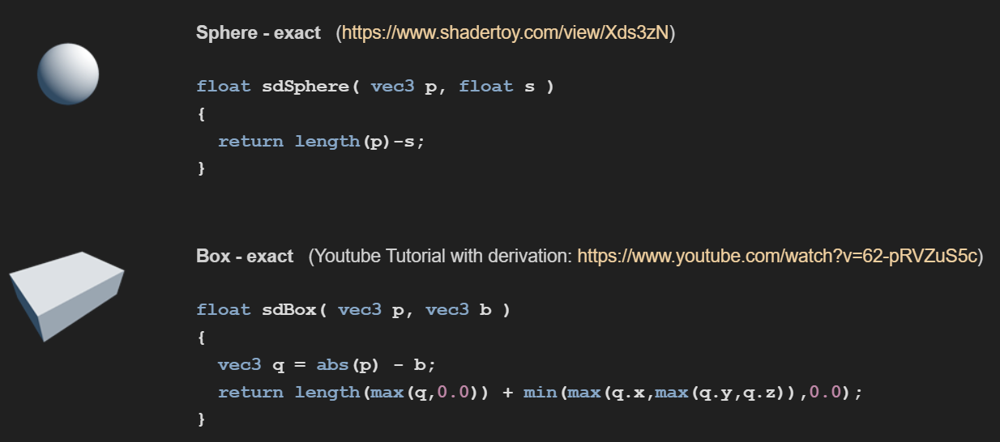

---

## Belysning och skuggning

Efter att ha hittat skärningspunkten kan raymarching beräkna belysning, skuggning och andra ytegenskaper med hjälp av traditionella strålspårningstekniker, såsom Phong-skuggning, reflektion och brytningsberäkningar.

---

## Phong-skuggning (shading)

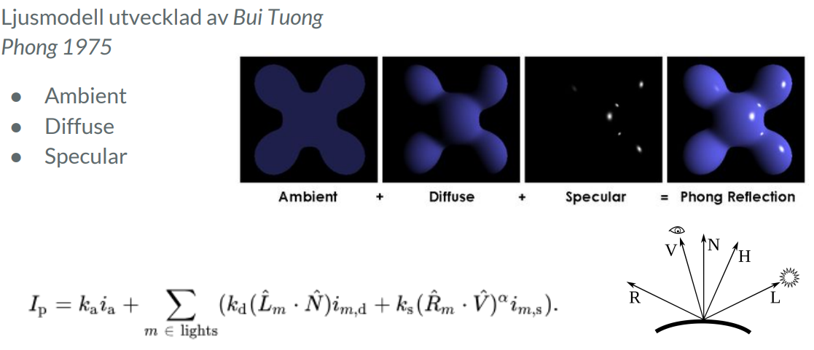

---

## Beräkna normal för en SDF

Funktionen `f(x,y,z)` är SDF funktionen, och &epsilon; motsvarar ett litet värde som 0.0001

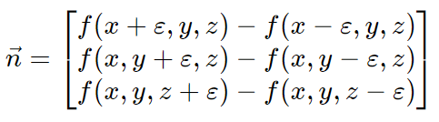

---
# Reflektioner

- Beräkna reflektionsvektor
  - `vec3 reflectedRayDirection = reflect(rayDirection, normal)`;
- Raymarcha igen
- Beräkna färg och ljus
- Addera till föregående resultat

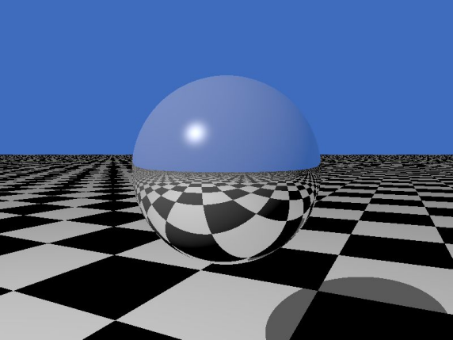

---

## CSG - Constructive Solid Geometry

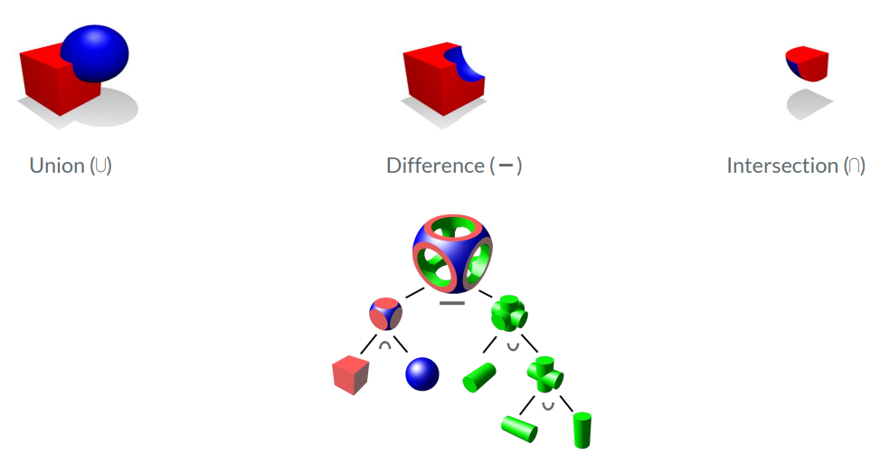

---

# Inspiration

- [Snail by iq](https://www.shadertoy.com/view/ld3Gz2)
- [Rainforest by iq](https://www.shadertoy.com/view/4ttSWf)
- [Selfie Girl by iq](https://www.shadertoy.com/view/WsSBzh)
- [Happy Jumping by iq](https://www.shadertoy.com/view/3lsSzf)
- [Insect by iq](https://www.shadertoy.com/view/Mss3zM)
- [Columns and Light by iq](https://www.shadertoy.com/view/lsf3zr)

---

# Resurser

- [WebGL API](https://developer.mozilla.org/en-US/docs/Web/API/WebGL_API)
- [WebGL Fundamentals](https://webglfundamentals.org/)
- [TWGL.js](https://twgljs.org/)
- [Three.js](https://threejs.org/)
- [Inigo Quiles website](https://iquilezles.org/)
- [Rendering worlds with two triangles (PDF)](https://iquilezles.org/articles/nvscene2008/rwwtt.pdf)
